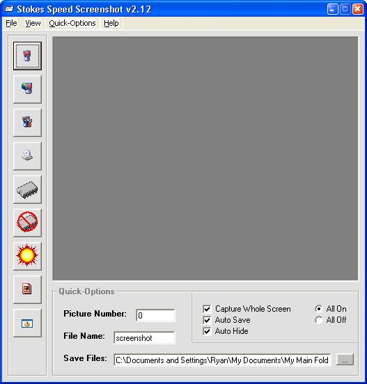



## Speed Screenshot v2\.12 \*\*\*\*UPDATED\*\*\*\*

### Description

This is the UPDATED version of the one i submited before. I added alot to it and its almost complete just need to debug it and finishing adding stuff. I included a Note text file for who ever wants to help finish it. For those of you taht did not see the first version this program takes screenshots really fast! You can shrink the main window if you want to take a full screen pic or use the toolbar too for speed shots or just shrink it all into your taskbar and press the hot key while say in a game that takes up your whole screen. Very usefull little program. If you like it please vote for me/ If you find bugs (i already know it has a few) you can post if you want. Thanks and enjoy :)
 
### More Info
 

             |
---                |---
**Submitted On**   |2004-05-06 16:18:46
**By**             |[Ryan33](https://github.com/Planet-Source-Code/PSCIndex/blob/master/ByAuthor/ryan33.md)
**Level**          |Advanced
**User Rating**    |4.8 (29 globes from 6 users)
**Compatibility**  |VB 6\.0
**Category**       |[Complete Applications](https://github.com/Planet-Source-Code/PSCIndex/blob/master/ByCategory/complete-applications__1-27.md)
**World**          |[Visual Basic](https://github.com/Planet-Source-Code/PSCIndex/blob/master/ByWorld/visual-basic.md)
**Archive File**   |[Speed\_Scre174237562004\.zip](https://github.com/Planet-Source-Code/ryan33-speed-screenshot-v2-12-updated__1-53624/archive/master.zip)

